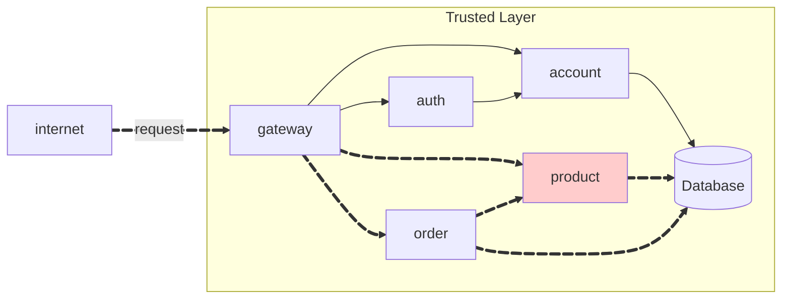
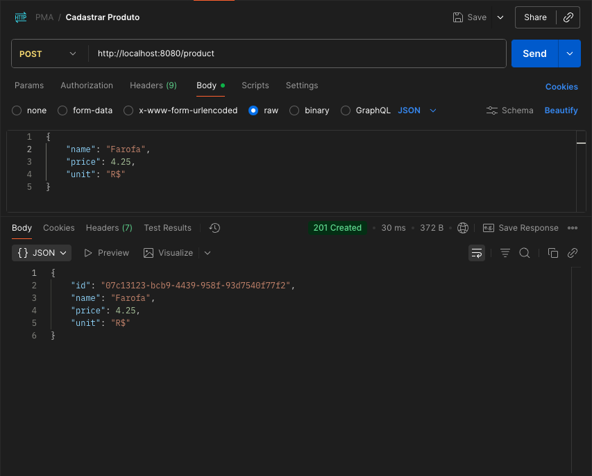
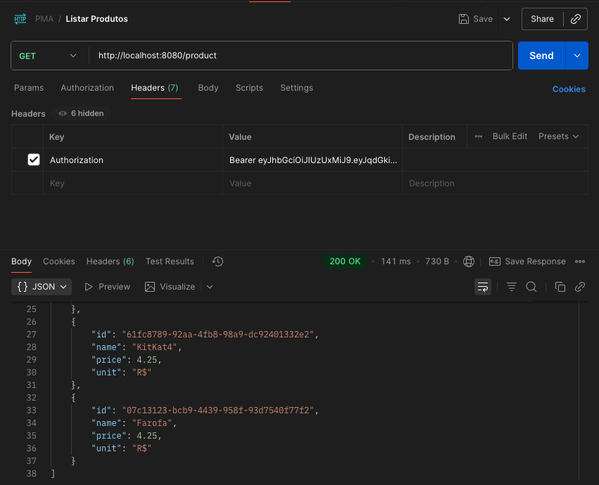
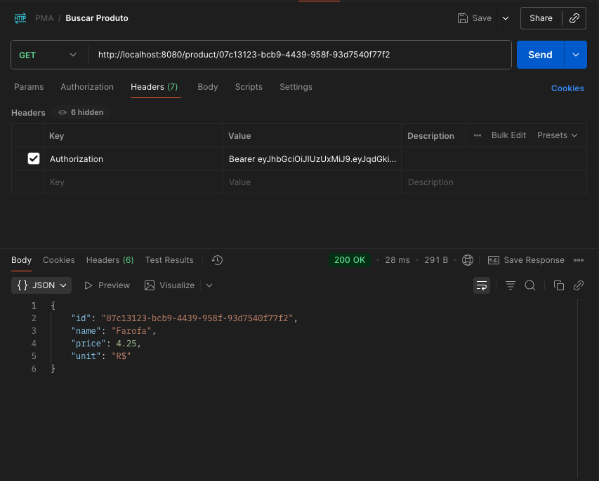
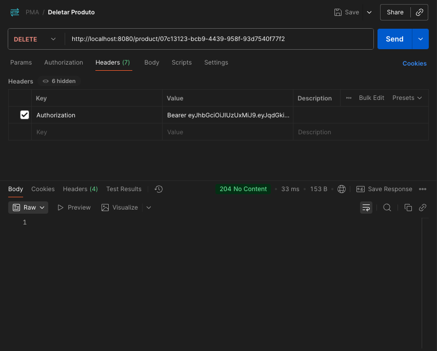

!!! warning "Attention"
    **To consume the API, the user must be authenticated.**

## Repositórios

### 1. Product Repository
**Link:** [https://github.com/pedrofardin/pma252.product](https://github.com/pedrofardin/pma252.product)

**Estrutura do projeto:**
```bash
product/
├── src/main/java/store/product/
│   ├── ProductController.java
│   ├── ProductIn.java
│   └── ProductOut.java
├── pom.xml
└── .gitignore
```

### 2. Product Service Repository
**Link:** [https://github.com/pedrofardin/pma252.product-service](https://github.com/pedrofardin/pma252.product-service)

**Descrição:** Repositório contendo a implementação completa do microserviço de produtos com Spring Boot.

**Estrutura do projeto:**
```bash
product-service/
├── src/main/
│   ├── Product.java
│   ├── ProductApplication.java
│   ├── ProductModel.java
│   ├── ProductParser.java
│   ├── ProductRepository.java
│   ├── ProductResource.java
│   └── ProductService.java
├── DockerFile
├── pom.xml
└── .gitignore
```

## Product API

The API should have the following endpoints:

!!! info "POST /product"

    Create a new product.

    === "Request"

        ``` { .json .copy .select linenums='1' }
        {
            "name": "Tomato",
            "price": 10.12,
            "unit": "kg"
        }
        ```

    === "Response"

        ``` { .json .copy .select linenums='1' }
        {
            "id": "0195abfb-7074-73a9-9d26-b4b9fbaab0a8",
            "name": "Tomato",
            "price": 10.12,
            "unit": "kg"
        }
        ```
        ```bash
        Response code: 201 (created)
        ```

    === "Postman"
        { width=100% }

!!! info "GET /product"

    Get all products.

    === "Response"

        ``` { .json .copy .select linenums='1' }
        [
            {
                "id": "0195abfb-7074-73a9-9d26-b4b9fbaab0a8",
                "name": "Tomato",
                "price": 10.12,
                "unit": "kg"
            },
            {
                "id": "0195abfe-e416-7052-be3b-27cdaf12a984",
                "name": "Cheese",
                "price": 0.62,
                "unit": "slice"
            },
            {
                "id": "97172619-f825-4755-93dd-d60852820bfd",
                "name": "Grape Juice",
                "price": 15.50,
                "unit": "liter"
            }
        ]
        ```
        ```bash
        Response code: 200 (ok)
        ```

    === "Postman"
        { width=100% }

!!! info "GET /product/{id}"

    Get a product by its ID.

    === "Response"

        ``` { .json .copy .select linenums='1' }
        {
            "id": "0195abfb-7074-73a9-9d26-b4b9fbaab0a8",
            "name": "Tomato",
            "price": 10.12,
            "unit": "kg"
        }
        ```
        ```bash
        Response code: 200 (ok)
        ```

    === "Postman"
        { width=100% }

!!! info "DELETE /product/{id}"

    Delete a product by its ID.

    === "Response"

        ```bash
        Response code: 204 (no content)
        ```

    === "Postman"
        { width=100% }

> This MkDocs was created by [Pedro Fardin](https://github.com/pedrofardin)