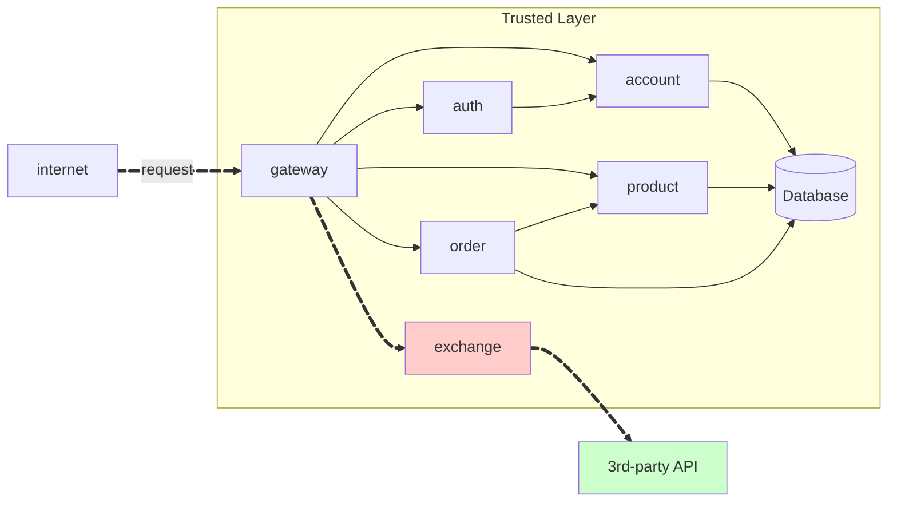
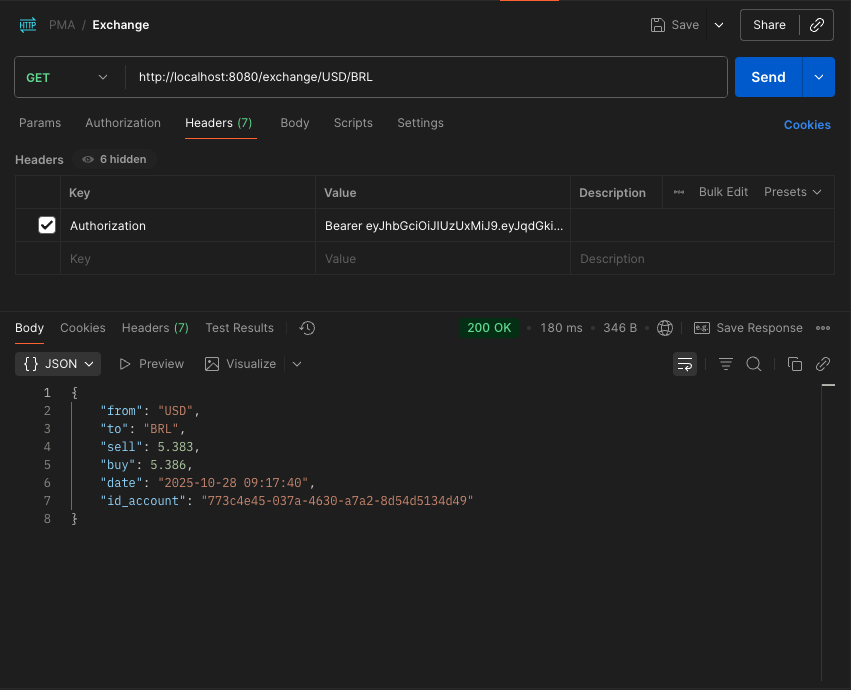

!!! warning "Attention"
    **To consume the API, the user must be authenticated.**

## Repositórios

### Exchange Service Repository
**Link:** [https://github.com/pedrofardin/pma252.exchange-service](https://github.com/pedrofardin/pma252.exchange-service)

**Descrição:** REST API que permite ao usuário converter entre moedas utilizando FastAPI.

**Estrutura do projeto:**
```bash
exchange-service/
├── main.py
├── requirements.txt
└── .gitignore
```

## Exchange API

The API should have the following endpoints:

!!! info "GET /exchange-rate/{from}/{to}"

    Get the current exchange rate from one currency to another. E.g. `GET /exchange-rate/USD/BRL`.

    === "Response"

        ``` { .json .copy .select linenums='1' }
        {
            "from": "USD",
            "to": "BRL",
            "sell": 5.383,
            "buy": 5.386,
            "date": "2025-10-28 09:17:40",
            "id_account": "773c4e45-037a-4630-a7a2-8d54d5134d49"
        }
        ```
        ```bash
        Response code: 200 (ok)
        ```

    === "Postman"
        { width=100% }

## Integration

This API uses the [AwesomeAPI](https://www.awesomeapi.com.br/) to get the current exchange rates between currencies.

> This MkDocs was created by [Pedro Fardin](https://github.com/pedrofardin)