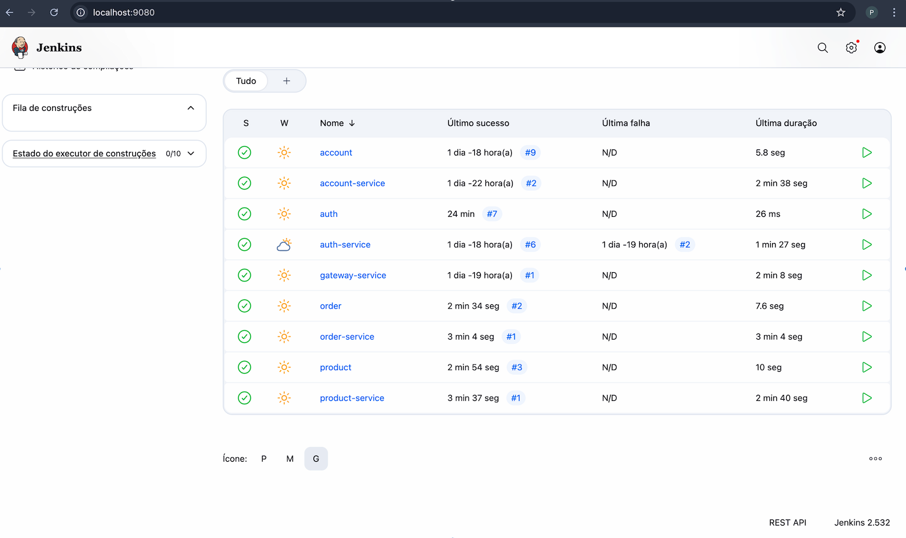

!!! warning "Attention"
    **Jenkins is used to automate the build, test, and deployment of all microservices.**

## Docker Compose

```yaml
# docker compose up -d --build --force-recreate
name: ops

services:

  jenkins:
    container_name: jenkins
    build:
      dockerfile_inline: |
        FROM jenkins/jenkins:jdk21
        USER root

        # Install tools
        RUN apt-get update && apt-get install -y lsb-release iputils-ping maven

        # Install Docker
        RUN curl -fsSLo /usr/share/keyrings/docker-archive-keyring.asc \
          https://download.docker.com/linux/debian/gpg
        RUN echo "deb [arch=$(dpkg --print-architecture) \
          signed-by=/usr/share/keyrings/docker-archive-keyring.asc] \
          https://download.docker.com/linux/debian \
          $(lsb_release -cs) stable" > /etc/apt/sources.list.d/docker.list
        RUN apt-get update && apt-get install -y docker-ce

        # Install kubectl
        RUN apt-get install -y apt-transport-https ca-certificates curl
        RUN curl -fsSL https://pkgs.k8s.io/core:/stable:/v1.30/deb/Release.key | gpg --dearmor -o /etc/apt/keyrings/kubernetes-apt-keyring.gpg
        RUN chmod 644 /etc/apt/keyrings/kubernetes-apt-keyring.gpg
        RUN echo 'deb [signed-by=/etc/apt/keyrings/kubernetes-apt-keyring.gpg] https://pkgs.k8s.io/core:/stable:/v1.30/deb/ /' | tee /etc/apt/sources.list.d/kubernetes.list
        RUN chmod 644 /etc/apt/sources.list.d/kubernetes.list
        RUN apt-get update && apt-get install -y kubectl

        RUN usermod -aG docker jenkins
    ports:
      - 9080:8080
    volumes:
      - ${CONFIG:-./config}/jenkins:/var/jenkins_home
      - /var/run/docker.sock:/var/run/docker.sock
    restart: always
```

**Access Jenkins at:** `http://localhost:9080`

## Jenkinsfile Examples

### Service Pipeline

```groovy
pipeline {
    agent any
    environment {
        SERVICE = 'order'
        NAME = "pedrofardin/${env.SERVICE}"
    }
    stages {
        stage('Dependencies') {
            steps {
                build job: 'product', wait: true
                build job: 'order', wait: true
            }
        }
        stage('Build') { 
            steps {
                sh 'mvn -B -DskipTests clean package'
            }
        }      
        stage('Build & Push Image') {
            steps {
                withCredentials([usernamePassword(
                    credentialsId: 'dockerhub-credential',
                    usernameVariable: 'USERNAME',
                    passwordVariable: 'TOKEN')])
                {
                    sh "docker login -u $USERNAME -p $TOKEN"
                    sh "docker buildx create --use --platform=linux/arm64,linux/amd64 --node multi-platform-builder-${env.SERVICE} --name multi-platform-builder-${env.SERVICE}"
                    sh "docker buildx build --platform=linux/arm64,linux/amd64 --push --tag ${env.NAME}:latest --tag ${env.NAME}:${env.BUILD_ID} -f Dockerfile ."
                    sh "docker buildx rm --force multi-platform-builder-${env.SERVICE}"
                }
            }
        }
    }
}
```

### Simple Pipeline

```groovy
pipeline {
    agent any

    stages {
        stage('Build') {
            steps {
                sh 'mvn -B -DskipTests clean install'
            }
        }
    }
}
```

## Jenkins Interface

{ width=100% }

> This MkDocs was created by [Pedro Fardin](https://github.com/pedrofardin)