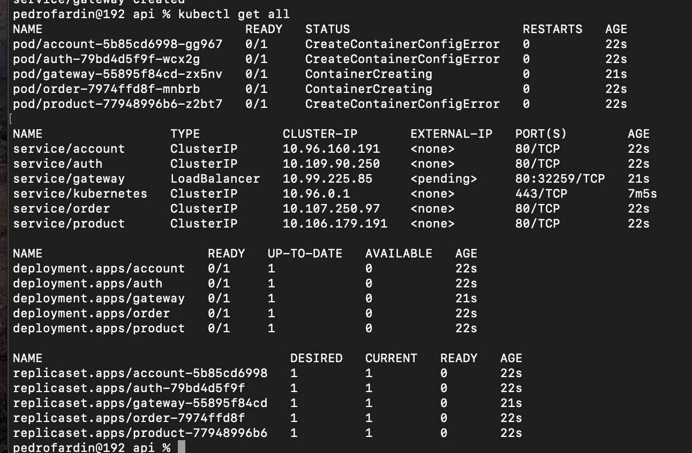

!!! warning "Attention"
    **Kubernetes should be installed and running on your local machine. You can use Minikube or Kind for this purpose.**

## Project Structure

```
📁 api/
├── 📁 account-service/
│   └── 📁 k8s/
│       └── 📄 k8s.yaml
├── 📁 auth-service/
│   └── 📁 k8s/
│       └── 📄 k8s.yaml
├── 📁 gateway-service/
│   └── 📁 k8s/
│       └── 📄 k8s.yaml
├── 📁 product-service/
│   └── 📁 k8s/
│       └── 📄 k8s.yaml
└── 📁 order-service/
    └── 📁 k8s/
        └── 📄 k8s.yaml
```

### Account Service

```yaml
apiVersion: apps/v1
kind: Deployment
metadata:
  name: account
spec:
  replicas: 1
  selector:
    matchLabels:
      app: account
  template:
    metadata:
      labels:
        app: account
    spec:
      containers:
        - name: account
          image: pedrofardin/account:latest
          imagePullPolicy: Always
          ports:
            - containerPort: 8080
          resources:
            requests:
              memory: "200Mi"
              cpu: "50m"
            limits:
              memory: "300Mi"
              cpu: "200m"

---
apiVersion: v1
kind: Service
metadata:
  name: account
  labels:
    app: account
spec:
  type: ClusterIP
  ports:
    - port: 80
      protocol: TCP
      targetPort: 8080
  selector:
    app: account
```

### Auth Service

```yaml
apiVersion: apps/v1
kind: Deployment
metadata:
  name: auth
spec:
  replicas: 1
  selector:
    matchLabels:
      app: auth
  template:
    metadata:
      labels:
        app: auth
    spec:
      containers:
        - name: auth
          image: pedrofardin/auth:latest
          imagePullPolicy: Always
          ports:
            - containerPort: 8080
          resources:
            requests:
              memory: "200Mi"
              cpu: "50m"
            limits:
              memory: "300Mi"
              cpu: "200m"

---
apiVersion: v1
kind: Service
metadata:
  name: auth
  labels:
    app: auth
spec:
  type: ClusterIP
  ports:
    - port: 80
      protocol: TCP
      targetPort: 8080
  selector:
    app: auth
```

### Product Service

```yaml
apiVersion: apps/v1
kind: Deployment
metadata:
  name: product
spec:
  replicas: 1
  selector:
    matchLabels:
      app: product
  template:
    metadata:
      labels:
        app: product
    spec:
      containers:
        - name: product
          image: pedrofardin/product:latest
          imagePullPolicy: Always
          ports:
            - containerPort: 8080
          env:
            - name: POSTGRES_DB
              valueFrom:
                configMapKeyRef:
                  name: postgres-configmap
                  key: POSTGRES_DB
            - name: DATABASE_USERNAME
              valueFrom:
                secretKeyRef:
                  name: postgres-secrets
                  key: POSTGRES_USER
            - name: DATABASE_PASSWORD
              valueFrom:
                secretKeyRef:
                  name: postgres-secrets
                  key: POSTGRES_PASSWORD
            - name: DATABASE_URL
              value: "jdbc:postgresql://postgres:5432/$(POSTGRES_DB)"
            - name: SPRING_CACHE_TYPE
              value: redis
            - name: SPRING_DATA_REDIS_HOST
              value: redis
            - name: SPRING_DATA_REDIS_PORT
              value: "6379"
          resources:
            requests:
              memory: "200Mi"
              cpu: "50m"
            limits:
              memory: "300Mi"
              cpu: "200m"

---
apiVersion: v1
kind: Service
metadata:
  name: product
  labels:
    app: product
spec:
  type: ClusterIP
  ports:
    - port: 80
      protocol: TCP
      targetPort: 8080
  selector:
    app: product
```

### Order Service

```yaml
apiVersion: apps/v1
kind: Deployment
metadata:
  name: order
spec:
  replicas: 1
  selector:
    matchLabels:
      app: order
  template:
    metadata:
      labels:
        app: order
    spec:
      containers:
        - name: order
          image: pedrofardin/order:latest
          imagePullPolicy: Always
          ports:
            - containerPort: 8080
          resources:
            requests:
              memory: "200Mi"
              cpu: "50m"
            limits:
              memory: "300Mi"
              cpu: "200m"

---
apiVersion: v1
kind: Service
metadata:
  name: order
  labels:
    app: order
spec:
  type: ClusterIP
  ports:
    - port: 80
      protocol: TCP
      targetPort: 8080
  selector:
    app: order
```

### Gateway Service

```yaml
apiVersion: apps/v1
kind: Deployment
metadata:
  name: gateway
spec:
  replicas: 1
  selector:
    matchLabels:
      app: gateway
  template:
    metadata:
      labels:
        app: gateway
    spec:
      containers:
        - name: gateway
          image: pedrofardin/gateway:latest
          imagePullPolicy: Always
          ports:
            - containerPort: 8080
          resources:
            requests:
              memory: "200Mi"
              cpu: "50m"
            limits:
              memory: "300Mi"
              cpu: "200m"

---
apiVersion: v1
kind: Service
metadata:
  name: gateway
  labels:
    app: gateway
spec:
  type: LoadBalancer
  ports:
    - port: 80
      protocol: TCP
      targetPort: 8080
  selector:
    app: gateway
```

{ width=100% }

> This MkDocs was created by [Pedro Fardin](https://github.com/pedrofardin)