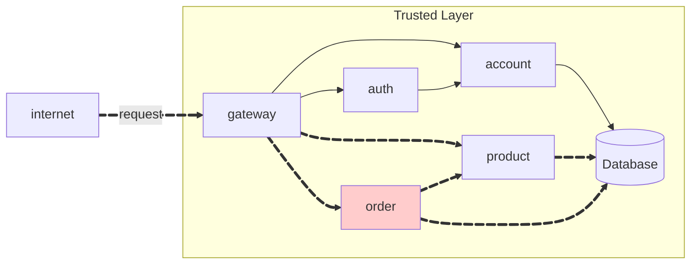
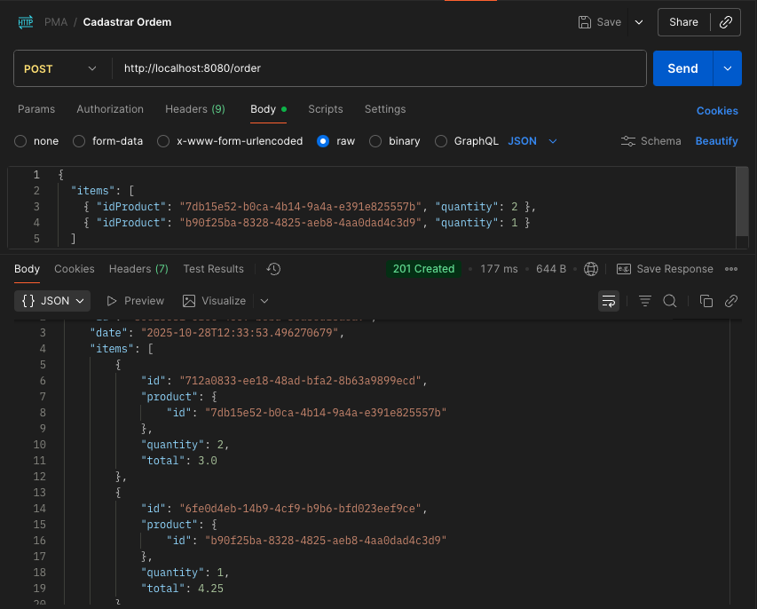
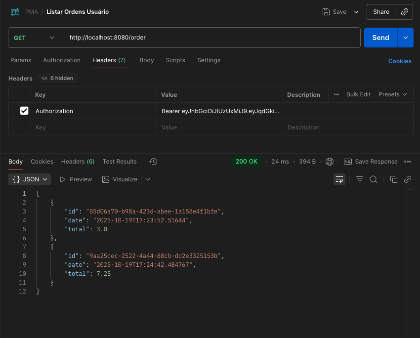
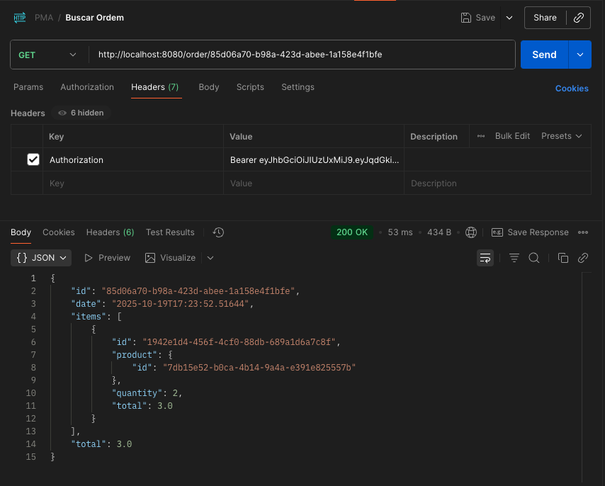

!!! warning "Attention"
    **To consume the API, the user must be authenticated.**

## Repositórios

### 1. Order Repository
**Link:** [https://github.com/pedrofardin/pma252.order](https://github.com/pedrofardin/pma252.order)

**Estrutura do projeto:**
```bash
order/
├── src/main/java/store/order/
│   ├── OrderController.java
│   ├── OrderIn.java
│   └── OrderOut.java
├── pom.xml
└── .gitignore
```

### 2. Order Service Repository
**Link:** [https://github.com/pedrofardin/pma252.order-service](https://github.com/pedrofardin/pma252.order-service)

**Descrição:** Repositório contendo a implementação completa do microserviço de pedidos com Spring Boot.

**Estrutura do projeto:**
```bash
order-service/
├── src/main/
│   ├── Order.java
│   ├── OrderApplication.java
│   ├── OrderItem.java
│   ├── OrderItemModel.java
│   ├── OrderModel.java
│   ├── OrderRepository.java
│   ├── OrderResource.java
│   ├── OrderService.java
├── DockerFile
├── pom.xml
└── .gitignore
```

## Order API

The API should have the following endpoints:

!!! info "POST /order"

    Create a new order **for the current user**.

    === "Request"

        ``` { .json .copy .select linenums='1' }
        {
            "items": [
                {
                    "idProduct": "0195abfb-7074-73a9-9d26-b4b9fbaab0a8",
                    "quantity": 2
                },
                {
                    "idProduct": "0195abfe-e416-7052-be3b-27cdaf12a984",
                    "quantity": 1
                }
            ]
        }
        ```

    === "Response"

        ``` { .json .copy .select linenums='1' }
        {
            "id": "0195ac33-73e5-7cb3-90ca-7b5e7e549569",
            "date": "2025-09-01T12:30:00",
            "total": 26.44,
            "items": [
                {
                    "id": "01961b9a-bca2-78c4-9be1-7092b261f217",
                    "product": {
                        "id": "0195abfb-7074-73a9-9d26-b4b9fbaab0a8",
                        "name": "Tomato",
                        "unit": "kg",
                        "price": 10.12
                    },
                    "quantity": 2,
                    "total": 20.24
                },
                {
                    "id": "01961b9b-08fd-76a5-8508-cdb6cd5c27ab",
                    "product": {
                        "id": "0195abfe-e416-7052-be3b-27cdaf12a984",
                        "name": "Cheese",
                        "unit": "slice",
                        "price": 0.62
                    },
                    "quantity": 10,
                    "total": 6.2
                }
            ]
        }
        ```
        ```bash
        Response code: 201 (created)
        Response code: 400 (bad request), if the product does not exist.
        ```

    === "Postman"
        { width=100% }

!!! info "GET /order"

    Get all orders **for the current user**.

    === "Response"

        ``` { .json .copy .select linenums='1' }
        [
            {
                "id": "85d06a70-b98a-423d-abee-1a158e4f1bfe",
                "date": "2025-10-19T17:23:52.51644",
                "total": 3.0
            },
            {
                "id": "9aa25cec-2522-4a44-88cb-dd2e3325153b",
                "date": "2025-10-19T17:24:42.484767",
                "total": 7.25
            },
            {
                "id": "80e18081-6fec-4669-bebd-36a3edf5aea9",
                "date": "2025-10-28T12:33:53.496271",
                "total": 7.25
            }
        ]
        ```
        ```bash
        Response code: 200 (ok)
        ```

    === "Postman"
        { width=100% }

!!! info "GET /order/{id}"

    Get the order details by its ID. **The order must belong to the current user.**, otherwise, return a `404`.

    === "Response"

        ``` { .json .copy .select linenums='1' }
        {
            "id": "0195ac33-73e5-7cb3-90ca-7b5e7e549569",
            "date": "2025-09-01T12:30:00",
            "total": 26.44,
            "items": [
                {
                    "id": "01961b9a-bca2-78c4-9be1-7092b261f217",
                    "product": {
                        "id": "0195abfb-7074-73a9-9d26-b4b9fbaab0a8",
                        "name": "Tomato",
                        "unit": "kg",
                        "price": 10.12
                    },
                    "quantity": 2,
                    "total": 20.24
                },
                {
                    "id": "01961b9b-08fd-76a5-8508-cdb6cd5c27ab",
                    "product": {
                        "id": "0195abfe-e416-7052-be3b-27cdaf12a984",
                        "name": "Cheese",
                        "unit": "slice",
                        "price": 0.62
                    },
                    "quantity": 10,
                    "total": 6.2
                }
            ]
        }
        ```
        ```bash
        Response code: 200 (ok)
        Response code: 404 (not found), if the order does not belong to the current user.
        ```

    === "Postman"
        { width=100% }

> This MkDocs was created by [Pedro Fardin](https://github.com/pedrofardin)